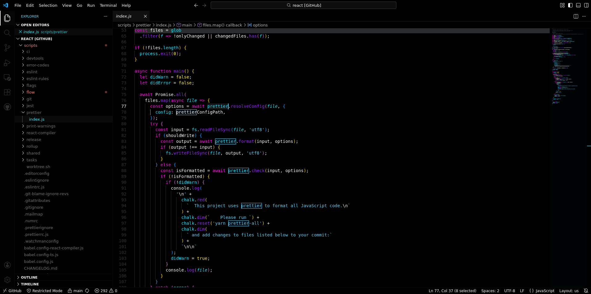

# A Lightweight Pure Black Theme

A minimalist, `open-source` theme with a clean dark aesthetic. Install and experience a calm, focused coding environment.

###

⭐ **Star us on GitHub** • 🚀 **Install now** • 💬 **Share feedback**

